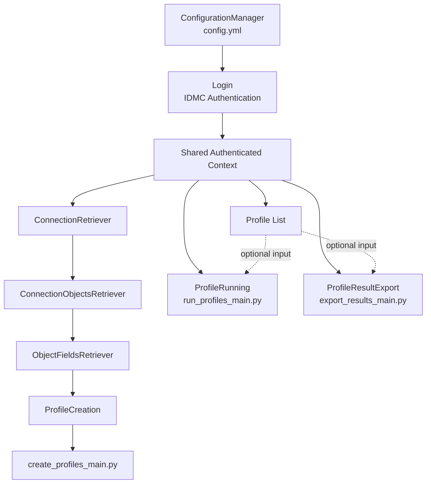

# Informatica IDMC Automated Profiling

This repository contains a Python project designed to **automate profiling activities in Informatica Intelligent Data Management Cloud (IDMC)**. The automation streamlines the processes of listing, creating, running, and exporting profile results, enabling efficient data profiling operations.

---

## Table of Contents

- [Project Overview](#project-overview)  
- [Architecture](#architecture)  
- [Configuration](#configuration)  
- [Usage](#usage)  
- [Packages and Modules](#packages-and-modules)  

---

## Project Overview

The project automates the end-to-end **data profiling lifecycle** in Informatica IDMC, including:

1. Logging into the platform.  
2. Listing profiles in a given folder/project.  
3. Creating profiles programmatically based on connections, tables, and fields.  
4. Running profiles.  
5. Exporting profile results for further analysis.  

---

## Architecture

The project is organized into multiple packages based on functionality:

- **`configuration_manager`**  
  - Contains `config.yml` for project configurations.  
  - `ConfigurationManager` class to load and manage configurations.  

- **`user_login`**  
  - Contains a `Login` class for handling user authentication with IDMC.  

- **`profile_list`**  
  - Handles retrieval of available profiles in a specific folder within a project.  

- **`profile_creation`**  
  - `connections_retriever.py` → `ConnectionRetriever` and `ConnectionObjectsRetriever` classes to retrieve connections and objects (tables).  
  - `object_fields_retriever.py` → `ObjectFieldsRetriever` class to retrieve fields in the tables.  
  - `profile_creation.py` → `ProfileCreation` class for creating profiles.  
  - `create_profiles_main.py` → Entry point for creating profiles.  

- **`profile_running`**  
  - `ProfileRunning` class to execute profiles.  
  - `run_profiles_main.py` → Entry point for running profiles.  

- **`profile_results_export`**  
  - `ProfileResultExport` class to export results.  
  - `export_results_main.py` → Entry point for exporting results.


## Configuration
- Open the config.yml file located in the configuration_manager package.
- Update it with your project-specific settings, including:
  - IDMC login credentials
  - Project and folder names
  - Connection details
  - Any other required fields
- Save the file. The project will automatically use these configurations when executing scripts.


## Usage

After configuring `config.yml`, the user can execute the main files according to the actions they want to perform:

### Create Profiles
```bash
python profile_creation/create_profiles_main.py
```
### Run Profiles
```bash
python profile_running/run_profiles_main.py
```
### Export Profile Results
```bash
python profile_results_export/export_results_main.py
```
The scripts will use the settings from config.yml, so the user only needs to edit it once for their environment.

---

## Packages and Modules

| Package | Description |
|---------|-------------|
| `configuration_manager` | Manages project configuration via `config.yml` |
| `user_login` | Handles user authentication |
| `profile_list` | Lists available profiles in a folder/project |
| `profile_creation` | Creates profiles using connections, tables, and fields |
| `profile_running` | Executes profiles |
| `profile_results_export` | Exports profile results |
